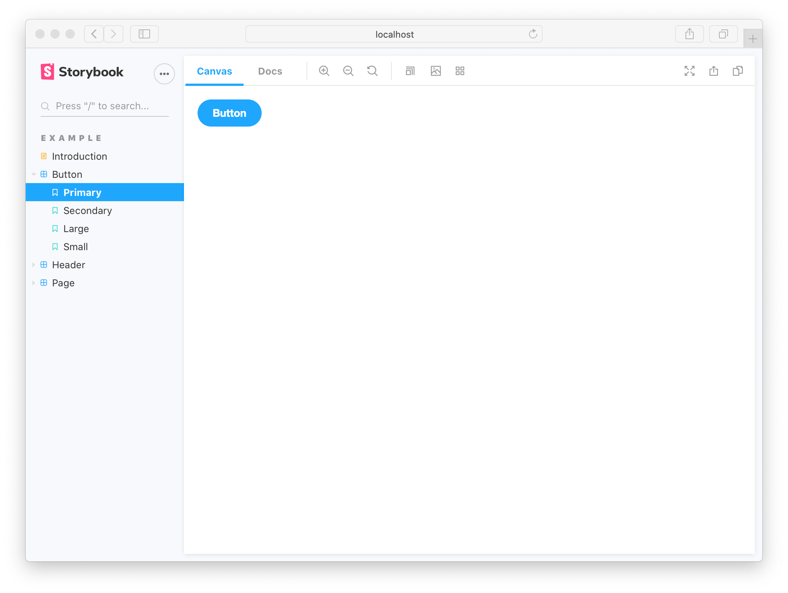
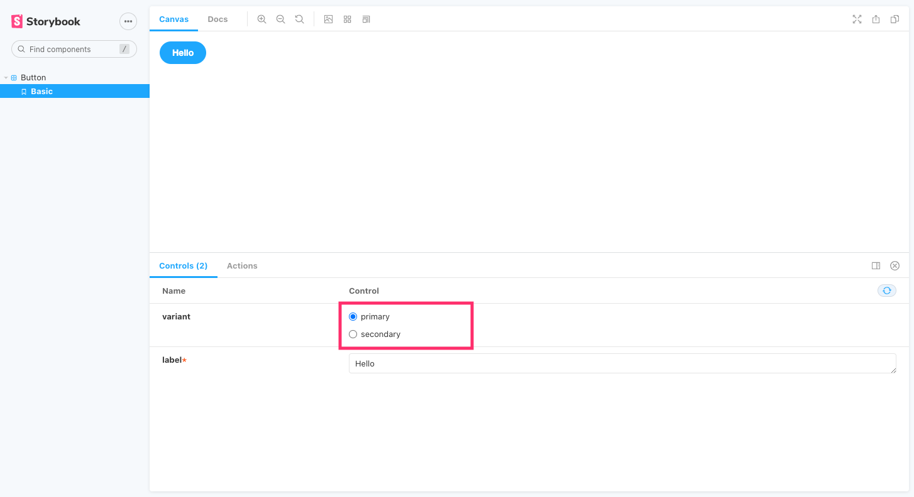

# **Storybook**


> _At the time of writing this, storybook is of version 6.5_

Quick guide written by AdmiJW.

<br/>
<br>

---
<br>


## 1. Introduction 👋🏻

If you are familiar with either React, Vue, or Angular, you should be familiar with components. Components act like individual Lego bricks that can be repeatedly reused and finally make up your project. 

However, if your project are huge and complex, and you've just created a new component that are yet to be tested. Where in the component tree of your project should you put your component in to test it? Or should you start a brand new project and put your component there to test it? The answer should be to use **Storybook**.

**Storybook** allows you to test your components individually, separated from your project. It provides the perfect environment in a team to test and document components created by different members.

This note will quickly walk through common techniques in using Storybook. `create-react-app` is used as the frontend framework, and TailwindCSS will be used to style components to make it look better.



---
<br>

## 2. Introduction (Technical) ⚙️

Install storybook into your project by running this in **your project root**:

```
npx storybook init
```

> *You have to create your project first, eg: `npx create-react-app`. This is because `npx storybook init` will have to automatically detect the framework type you are using.*

You will see two new directories: `.storybook` inside the project root directory, and `stories` under `src` directory.

`.storybook` directory contains `main.js` and `preview.js`, mainly for configurations (such as adding an storybook add on). 

`stories` directory contains all the stories, which are the "tests" that you will be writing to test the components in isolation. By default, it provides example stories. If you don't like them, feel free to delete everything inside this directory.

---
<br>

## 2.1 (Bonus) - TailwindCSS in Storybook

Normally, you have to include `.css` files into the storybook in order for it to use the defined styles, either by including it in `.storybook/preview.js` or individually inside each of the `..stories.js` you wrote.

```js
// .storybook/preview.js
...
include '../src/path_to_your_style/style.css';
...
```

This rule includes libraries like `Bootstrap`. You just have to include the core bootstrap styles into preview.js.

TailwindCSS uses PostCSS, so you need to do more than just including it. Follow the steps below to include TailwindCSS in your storybook.

1. Follow every step of [Tailwind Installation Guide](https://tailwindcss.com/docs/guides/create-react-app). This link is for applications created using `create-react-app`.

1. You shall follow the rest with [This Stackoverflow Guide](https://stackoverflow.com/questions/65495912/storybook-tailwind-how-should-i-add-tailwind-to-storybook):

1. Restart storybook server and you shall see the changes.

---
<br>

## 3. Stories 📔

A story file ends with something like `.stories.js`, example: `Button.stories.js`. This file shall then contain stories from the `Button.js` React component.

A story file shall contain at least two exports: **A default one, and one or more named exports**.

* The default export defines metadata about the story. The simpliest one may look like this:

    ```js
    export default {
    // title
    // Optional. This will be shown on storybook ui as the title of the story. You can also define it to be path like, eg: 'Component/Button'. Storybook will automatically structure for you 
    title: 'Button',
    // The React component
    component: Button,
    };
    ```

* Each named export correspond to different stories of the component. The variable name you exported will be used, unless explicitly set otherwise. The value shall be a **function that returns JSX, just like React component does**.

    ```js
    export const Primary = () => <Button primary>Button</Button>;
    export const Secondary = () => <Button secondary>Button</Button>;

    // In Storybook, you will see two stories: 'Primary' and 'Secondary'.
    ```

A sample story file may look like this:

```js
import React, { useState } from 'react';

import { Button } from './Button';


// Default export - title and component
export default {
  title: 'Button',
  component: Button,
};


// Named exports - stories
export const Primary = () => {
  // This example use react hooks. You don't have to
  const [value, setValue] = useState('Secondary');
  const [isPrimary, setIsPrimary] = useState(false);

  const handleOnChange = () => {
    if (!isPrimary) {
      setIsPrimary(true);
      setValue('Primary');
    }
  };
  return <Button primary={isPrimary} onClick={handleOnChange} label={value} />;
};
```


---
<br>

## 4. `args` Pattern 👀

A recommended pattern to write stories, is to:

1. Define a template function that will allow you to pass in arguments, and returns the component

1. Each story will clone the template function, and define the `args` property to pass in your `props` (in React's term).

The benefits with this pattern:

1. Reduced boilerplate code. Instead of repeating `<Button>...</Button>` in each story, you just use the template function.

1. **Storybook can detect the existing `args` property in the story function, and provide controls for you to modify the props passed into the state directly from the interface!**

    

An example of a story file that uses `args` pattern shall look like this:

```js
import React from 'react';

import { Button } from './Button';

export default {
  title: 'Button',
  component: Button,
};

//👇 We create a “template” of how args map to rendering
const Template = (args) => <Button {...args} />;

// 👇 Each story then reuses that template
// bind() function will create a copy of the Template function, provided 
export const Primary = Template.bind({});
Primary.args = { backgroundColor: '#ff0', label: 'Button' };

export const Secondary = Template.bind({});
Secondary.args = { ...Primary.args, label: '😄👍😍💯' };

export const Tertiary = Template.bind({});
Tertiary.args = { ...Primary.args, label: '📚📕📈🤓' };
```

Read more on controls [HERE](https://storybook.js.org/docs/react/essentials/controls)

---
<br>

## 5. Addons 📚

The newest storybook (v6+) ships with [Essential Addons](https://storybook.js.org/docs/react/essentials/introduction). These addons are:

* *Docs* - Automatically generates documentation for your components.
* **Controls** - Change your `args` directly from the interface
* **Actions** - View events, such as onClick
* **Viewport** - Test components in different screen sizes
* **Backgrounds** - Change the background, such as dark mode
* **Toolbars & globals** 
* **Measure & outline** - Grids, measurement tools and outline

You can also add in new addons, such as the `a11y` addon to view accessibility issues with your component.

---
<br>

## 6. Build Storybook 🚧

Want to publish your storybook (Or just share it with your team) without them having to install storybook too? Inside `package.json` you will see a `build-storybook` script. That is exactly for this purpose.


```bash
npm run build-storybook
```

```bash
yarn build-storybook
```

---
<bv>

## 7. Final Words 🤗

Please note that this is simply a quick guide to let you get started on storybook. Many concepts are yet to be explored, such as `decorators`, `actions`, `play function` etc. You can keep exploring on [Official Docs Webpage](https://storybook.js.org/docs/react/writing-stories/introduction)